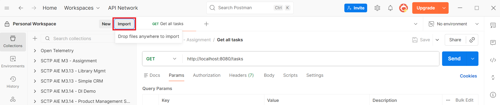
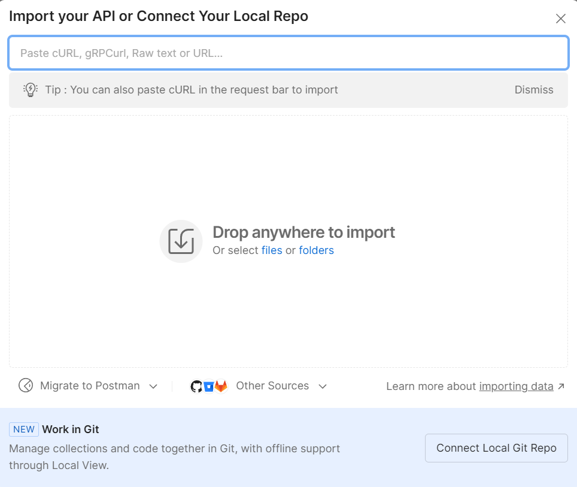
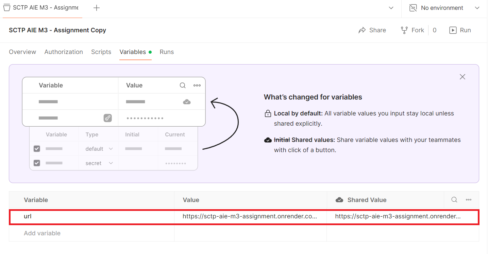

# Module 3 Assignment - Task Management API

## About the assignment

The assignment is to build a simple TaskFlow API, a task management layered backend, using Spring Boot project,  and push it to [GitHub](https://github.com/ensanguine2279/sctp-aie-m3-assignment/tree/main).

Click [here](./Module3_Assignment_mandatory.md) for the assignment details & requirements.

## API documentation

|**Method**|**Path**|**What it does**|
|---|---|---|
|GET|`/api/tasks`|Get all tasks|
|GET|`/api/tasks/{id}`|Get one task by id|
|GET|`/api/tasks/summarize`|Summarize all tasks|
|POST|`/api/tasks`|Create a new task|
|PUT|`/api/tasks/{id}`|Update an existng task|
|PUT|`/api/tasks/{id}/`<br>`complete`|Mark a task as complete|
|DELETE|`/api/tasks/{id}`|Delete a task|


Click [here](./SCTP%20AIE%20M3%20-%20Assignment.postman_collection.json) for the Postman collection of the API endpoints. 

You can download the collection and import it into Postman for testing.

<br>



<br>



## Testing APIs

The endpoints have been deployed **live** on [Render](https://render.com/) free tier. 

You can test the APIs from the base url https://sctp-aie-m3-assignment.onrender.com/api/tasks.  

> **Postman Collection Variable**: The base url is defined in the collection variable `{{url}}` in the postman collection. If you were to deploy the APIs into another local/cloud environment/platform, you will need to update the value of the `{{url}}` variable



> **Free Tier Inactivity**: Note that Render spins down free-tier web services after 15 minutes of inactivity. A new incoming request will experience a "cold start" delay of about 30–50 seconds while the instance wakes back up.

## Configuring the APIs

### LLM model settings

You can configure the model used for summarizing tasks and the associated temperature hyperparameter using the following settings in the [application.properties](./src/main/resources/application.properties).

> *Never* expose your API key: You should not hardcode your API key in the `application.properties`. Always inject the key as an environment variable in the hosting environment.  Spring Boot will derive the value of `${OPENAI_API_KEY}` and set the property during runtime.

``` yaml
spring.ai.openai.api-key=${OPENAI_API_KEY}
spring.ai.openai.chat.model=gpt-4o-mini
spring.ai.openai.chat.temperature=0.7
```